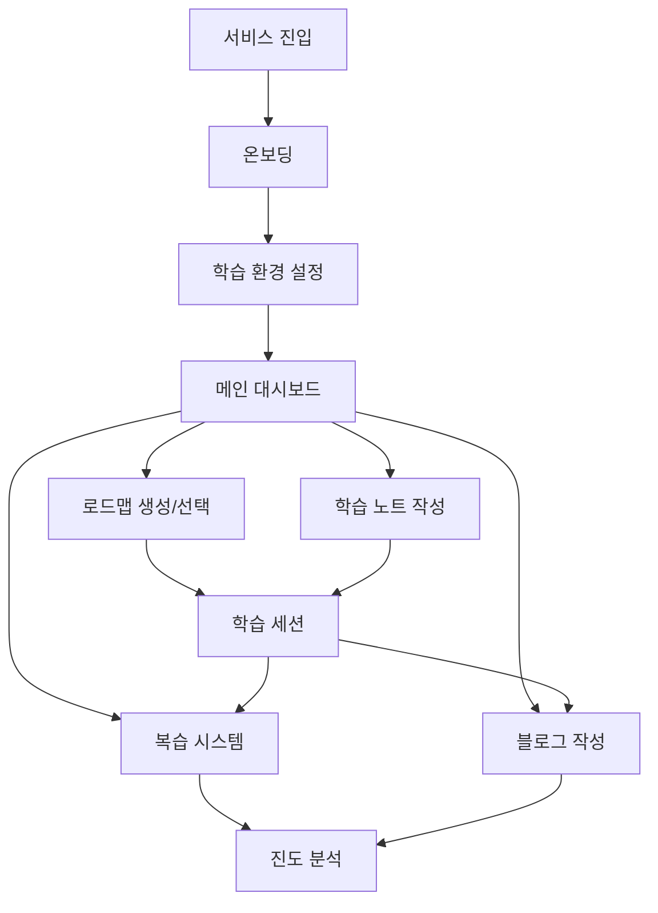
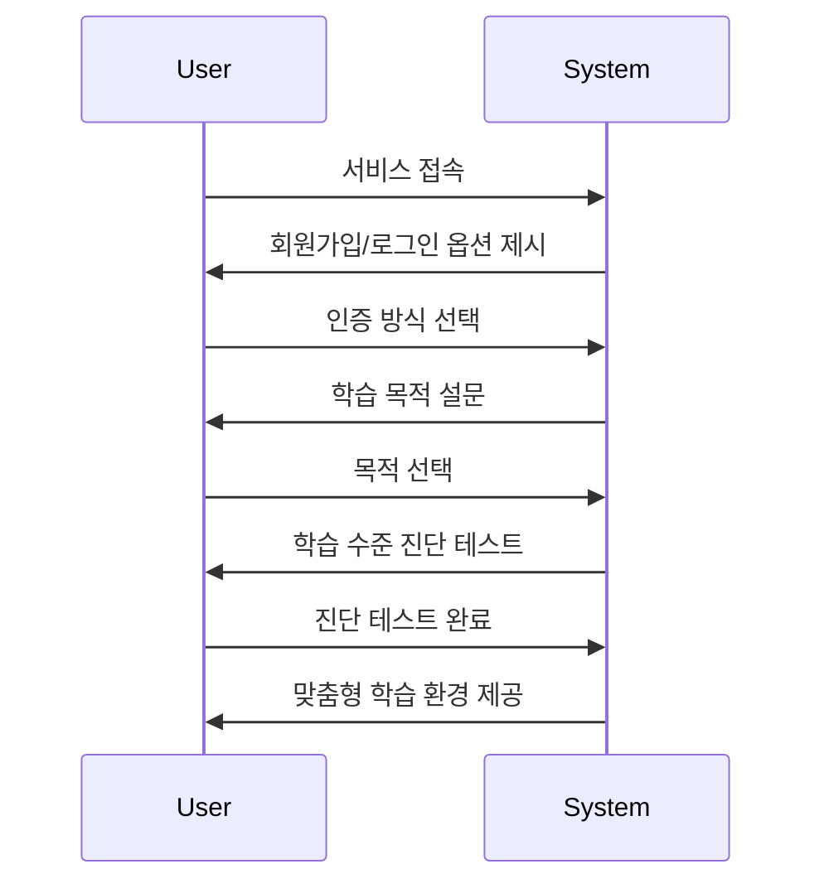
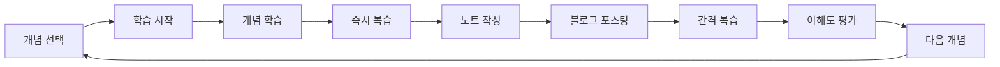
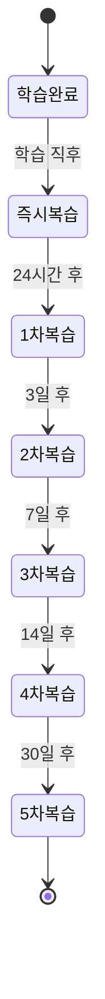
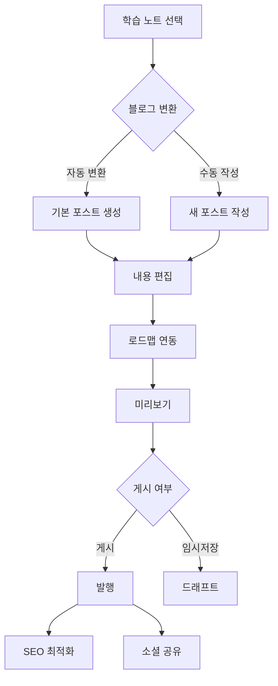
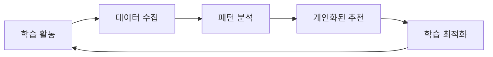

# Synaptic - 상세 유저 플로우

## 1. 최초 진입 및 온보딩 (First-time User Flow)

### A. 서비스 진입
1. **앱 실행 및 회원가입**
   ```typescript
   interface OnboardingFlow {
     step1: {
       action: "회원가입/로그인 선택";
       options: ['이메일', 'Google', 'GitHub'];
       duration: "1-2분";
     };
     step2: {
       action: "학습 목적 설정";
       options: [
         '기술 면접 준비',
         '개념 학습',
         '실무 지식 향상'
       ];
     };
     step3: {
       action: "학습 수준 진단";
       assessment: {
         duration: "5-7분",
         questionTypes: ['객관식', '주관식', '개념연결'],
         adaptiveDifficulty: true
       };
     };
   }
   ```

### B. 초기 설정
1. **학습 환경 커스터마이징**
   ```typescript
   interface LearningPreferences {
     dailyGoal: {
       studyTime: number; // 분 단위
       preferredTimeSlots: TimeRange[];
       reminderSettings: NotificationPreference;
     };
     contentPreferences: {
       preferredFormat: ['텍스트', '비디오', '인터랙티브'];
       difficultyLevel: 1-5;
       detailLevel: 'basic' | 'intermediate' | 'advanced';
     };
   }
   ```

## 2. 학습 세션 시작 (Learning Session Initiation)

### A. 주제 선택
1. **개념 탐색**
   ```typescript
   interface ConceptSelection {
     searchOptions: {
       keywords: string[];
       filters: {
         difficulty: number;
         estimatedTime: number;
         category: string[];
       };
     };
     recommendations: {
       based_on: 'level' | 'interests' | 'learning_path';
       suggestions: ConceptNode[];
     };
   }
   ```

2. **학습 경로 확인**
   ```typescript
   interface LearningPathView {
     mainConcept: {
       title: "HTTP",
       difficulty: 3,
       estimatedTime: 45 // 분
     };
     relatedConcepts: {
       upstream: ["네트워크", "인터넷 프로토콜"],
       downstream: ["HTTPS", "REST API"],
       parallel: ["TCP/IP", "웹 서버"]
     };
   }
   ```

## 3. 실제 학습 과정 (Active Learning Process)

### A. 메인 학습
1. **개념 소개**
   ```typescript
   interface LearningFlow {
     introduction: {
       duration: "3-5분";
       elements: {
         conceptOverview: string;
         keyPoints: string[];
         visualAid: Visualization;
       };
     };
     mainContent: {
       duration: "15-20분";
       sections: {
         theory: DetailedContent;
         examples: PracticalExample[];
         interactive: InteractiveElement[];
       };
     };
     practice: {
       duration: "10-15분";
       exercises: {
         basic: Exercise[];
         intermediate: Exercise[];
         advanced: Exercise[];
       };
     };
   }
   ```

2. **진행 중 상호작용**
   ```typescript
   interface LearningInteraction {
     checkpoints: {
       frequency: "매 5-7분";
       type: 'quiz' | 'recap' | 'connection';
     };
     userActions: {
       noteCreation: boolean;
       bookmarking: boolean;
       questionAsking: boolean;
     };
     progressTracking: {
       completionRate: number;
       comprehensionScore: number;
       attentionMetrics: number;
     };
   }
   ```

## 4. 복습 사이클 (Review Cycle)

### A. 즉시 복습
1. **학습 직후 확인**
   ```typescript
   interface ImmediateReview {
     duration: "5-7분";
     activities: {
       quickRecap: {
         type: "키워드 작성";
         format: "마인드맵";
       };
       conceptCheck: {
         type: "핵심 개념 확인";
         format: "객관식";
       };
     };
   }
   ```

### B. 간격 복습
1. **첫 번째 복습 (24시간 후)**
   ```typescript
   interface FirstReview {
     notification: {
       timing: "학습 24시간 후";
       type: "푸시 알림";
       message: string;
     };
     session: {
       duration: "10-15분";
       components: {
         warmup: "자유 회상" // 2-3분
         keyPoints: "핵심 내용 복습" // 5분
         connections: "개념 연결" // 5분
         assessment: "이해도 체크" // 3분
       };
     };
   }
   ```

2. **후속 복습**
   ```typescript
   interface FollowUpReview {
     schedule: {
       day3: ReviewSession;  // 3일 후
       day7: ReviewSession;  // 7일 후
       day14: ReviewSession; // 14일 후
       day30: ReviewSession; // 30일 후
     };
     adaptiveAdjustment: {
       based_on: 'performance' | 'confidence';
       modifications: {
         interval: number;
         difficulty: number;
         content: string;
       };
     };
   }
   ```

## 5. 블로그 작성 및 관리 (Blog Creation and Management)

### A. 블로그 작성
1. **블로그 에디터 사용**
   ```typescript
   interface BlogEditor {
     features: {
       markdownSupport: boolean;
       wysiwygSupport: boolean;
       codeHighlighting: boolean;
       mediaAttachment: boolean;
       livePreview: boolean;
     };
   }
   ```

2. **게시물 관리**
   ```typescript
   interface BlogManagement {
     actions: {
       publish: boolean;
       unpublish: boolean;
       edit: boolean;
       delete: boolean;
       versionControl: boolean;
     };
   }
   ```

### B. 블로그와 로드맵 연동
1. **로드맵 노드와 블로그 연결**
   ```typescript
   interface BlogRoadmapIntegration {
     linkNodeToBlog: boolean;
     displayRoadmapInBlog: boolean;
   }
   ```

2. **블로그 내 로드맵 시각화**
   ```typescript
   interface BlogVisualization {
     roadmapPreview: boolean;
     highlightSpecificNodes: boolean;
   }
   ```

## 6. 진행도 확인 및 피드백 (Progress Check & Feedback)

### A. 학습 분석
```typescript
interface LearningAnalytics {
  session: {
    timeSpent: number;
    conceptsCovered: string[];
    exercisesCompleted: number;
    accuracy: number;
  };
  retention: {
    immediateRecall: number;
    dayOneRetention: number;
    weekOneRetention: number;
  };
  recommendations: {
    nextSteps: string[];
    focusAreas: string[];
    supplementaryMaterial: Resource[];
  };
}
```

### B. 성과 리뷰
```typescript
interface PerformanceReview {
  metrics: {
    comprehensionScore: number;
    retentionRate: number;
    connectionStrength: number;
  };
  feedback: {
    strengths: string[];
    improvements: string[];
    suggestions: string[];
  };
  nextActions: {
    recommendedConcepts: ConceptNode[];
    reviewSchedule: ReviewSession[];
    practiceExercises: Exercise[];
  };
}
```

## 7. 시각화된 유저 플로우 (Flow Visualization)

### A. 전체 서비스 플로우


### B. 상세 온보딩 프로세스


### C. 학습 사이클


### D. 복습 시스템 플로우


### E. 블로그 작성 프로세스


### F. 데이터 수집 및 분석 플로우


이러한 시각화된 플로우는 서비스의 주요 기능들이 어떻게 상호 연결되어 있는지, 그리고 사용자가 어떤 경로로 서비스를 이용하게 되는지를 명확하게 보여줍니다.
